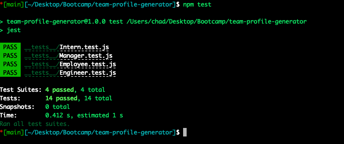

# Team Profile Generator

## Description
This project generates a webpage that lists out a team based on user input in the command line.

## Table of Contents
* [Installation](#installation)
* [Usage](#usage)
* [Testing](#testing)
* [Questions](#questions)

## Installation
To install, clone the files to machine and make sure node is installed. Use 'npm install' to install third party packages from npm.

## Usage
Type the command 'node index.js' to command line and answer the prompts, adding the necessary number of employees. Once you've gone through all the prompts, an HTML file will be generated along with a style sheet in the 'dist' directory

## Testing
Jest was used for testing the objects created in 'lib' folder. Use 'npm test' command to see the testing results.

## Questions
If you have any questions or to see other projects I've done, view my GitHub page here: https://github.com/chaldrich24.

## License
There is no license for this project.

## Links / Screenshots
Here is a screen recording of how to use the application: https://watch.screencastify.com/v/lrPhHnuMQUQFUK7b26so.

